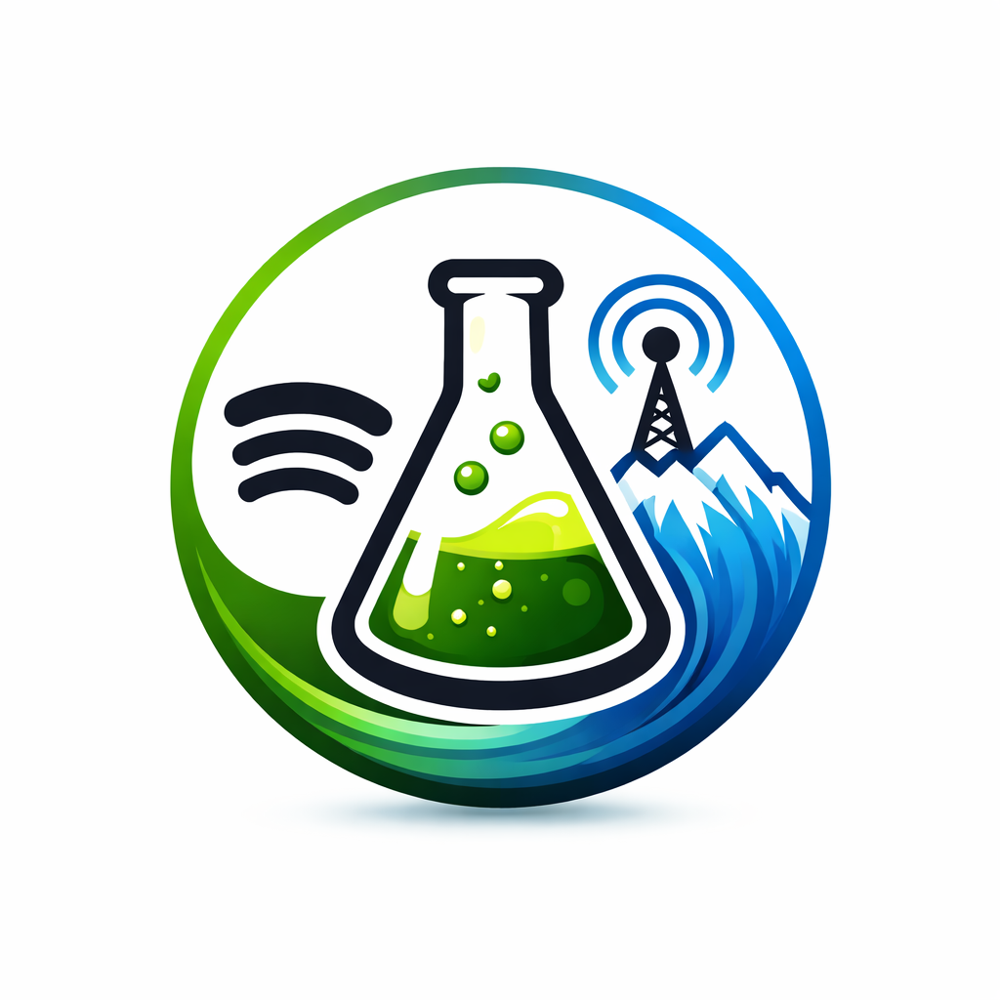

<!--
Spotycast README — SEO / conversion oriented GitHub landing page
Palette aligned with social preview:
- bg: #0b1220 / #14233a
- green: #1db954
- blue: #457aff
- teal: #1abc9c
- violet: #8a5fff
-->

<p align="center">
  
</p>

<h1 align="center">Spotycast — Spotify to Icecast Bridge for Roon, LMS, Volumio and HTTP Audio Players</h1>

<p align="center">
  <a href="https://spotycast.ovh"></a>
  <a href="https://spotycast.ovh/how-to-install/"></a>
  <a href="https://spotycast.ovh/spotify-with-roon/"></a>
  <a href="https://spotycast.ovh/spotify-to-icecast/"></a>
  <a href="./LICENSE"></a>
</p>

<p align="center">
  <strong>Turn Spotify playback into a stable HTTP / Icecast stream for Roon, LMS (Lyrion), Volumio and network players.</strong><br>
  Restore the radio-style endpoint your audiophile stack is missing.
</p>

---

<table>
  <tr>
    <td width="58%" valign="top">

## Why Spotycast exists

Many audio stacks break at the exact place that should be the simplest: the reusable source endpoint.

DACs are fine. Renderers are fine. Network players are fine.  
What often disappears is the **stable HTTP radio URL** you can point everything to.

**Spotycast solves that gap** by republishing Spotify playback to Icecast, so your stack gets one resilient LAN stream endpoint that can be consumed almost anywhere.

It is especially useful when you want:

- **Spotify with Roon**
- **Spotify to Icecast**
- **a headless Spotify Connect endpoint on Debian**
- **a single HTTP stream URL for mixed players**
- **a practical workaround for Spotify in ecosystems that do not integrate it natively**

</td>
<td width="42%" valign="top">

<div align="center">

```text
Spotify → PulseAudio → Liquidsoap → Icecast → Roon / LMS / Volumio / Players
```

</div>

<br>

<table>
  <tr>
    <td align="center"><strong>Stable path</strong></td>
    <td align="center"><strong>Single URL</strong></td>
    <td align="center"><strong>LAN friendly</strong></td>
  </tr>
  <tr>
    <td align="center">Spotify Connect or app</td>
    <td align="center">One Icecast mount</td>
    <td align="center">Works like radio</td>
  </tr>
</table>

</td>
  </tr>
</table>

---

## Best entry points

<table>
  <tr>
    <td><strong>Spotify with Roon</strong><br><a href="https://spotycast.ovh/spotify-with-roon/">Use Spotify as a stable stream source for Roon-based setups</a></td>
  </tr>
  <tr>
    <td><strong>Spotify to Icecast</strong><br><a href="https://spotycast.ovh/spotify-to-icecast/">Publish Spotify playback as an HTTP / Icecast endpoint</a></td>
  </tr>
  <tr>
    <td><strong>Installation guide</strong><br><a href="https://spotycast.ovh/how-to-install/">Install Spotycast on Debian or Docker</a></td>
  </tr>
  <tr>
    <td><strong>How it works</strong><br><a href="https://spotycast.ovh/how-it-works/">Architecture, pipeline and signal flow</a></td>
  </tr>
  <tr>
    <td><strong>Spotify Lossless and Roon</strong><br><a href="https://spotycast.ovh/spotify-lossless-roon/">What “lossless Spotify with Roon” really means in practice</a></td>
  </tr>
  <tr>
    <td><strong>FAQ</strong><br><a href="https://spotycast.ovh/faq/">Answers about latency, quality, compatibility and usage</a></td>
  </tr>
</table>

---

## What Spotycast does

Spotycast republishes Spotify playback as a standard HTTP audio stream:

```text
Spotify → PulseAudio → Liquidsoap → Icecast → Player
```

That means you stop depending on native Spotify support on every playback device.

Instead, you expose **one stable radio-style endpoint** on your LAN and feed it to:

- **Roon**
- **LMS / Lyrion Music Server**
- **Volumio**
- **hardware streamers**
- **embedded players**
- **any device that accepts a radio URL or HTTP stream**

This is why Spotycast is useful in heterogeneous audio environments: old devices, mixed ecosystems, abandoned firmware, single-zone DACs, or setups that simply work better with one canonical stream source.

---

## Spotify with Roon: what this project is really for

If you searched for **Spotify with Roon**, **Spotify in Roon**, **Roon Spotify workaround**, or **Spotify lossless Roon**, this repository is probably relevant.

Roon still does not provide native Spotify integration, so many users end up needing an external bridge.

Spotycast does **not** make Spotify natively appear inside Roon.  
What it does is often more practical in real-world systems:

- create an **HTTP stream endpoint**
- make that stream **stable and reusable**
- let Roon consume it as a radio source
- keep your downstream playback topology consistent

That makes Spotycast a good fit when the goal is not theoretical purity but **operational reliability in a real network audio stack**.

Read more:  
**<a href="https://spotycast.ovh/spotify-with-roon/">Spotify with Roon</a>**  
**<a href="https://spotycast.ovh/spotify-lossless-roon/">Spotify Lossless with Roon</a>**

---

## Two upstream paths, one output philosophy

Spotycast is centered around the same downstream idea:  
**publish one reliable Icecast / HTTP endpoint for the rest of the system**.

### 1) Stable Spotify Connect path

This path uses **spotifyd** and focuses on simplicity and robustness.

Use it when you want:

- headless deployment
- Debian-friendly setup
- Spotify Connect behavior
- predictable operation
- a stable lossy path up to Spotify’s standard quality ceiling

### 2) Advanced path

This path is for more advanced scenarios where the objective is to preserve as much quality and control as possible in systems where native options are limited or missing.

Use it when your priority is:

- higher-quality workflows
- more advanced automation
- stronger control over the bridge behavior
- working around ecosystem limitations in legacy or hybrid environments

Details:  
**<a href="https://spotycast.ovh/version-premium/">Premium / advanced mode</a>**

---

## Why an Icecast / HTTP endpoint matters

A radio-style endpoint is valuable because it is:

- **simple**
- **portable**
- **inspectable**
- **compatible with many players**
- **decoupled from app-specific integrations**

When your whole system can consume one HTTP stream, your stack becomes easier to reason about and easier to keep stable over time.

That is the core idea behind Spotycast:

> not “Spotify everywhere natively”  
> but “one reusable endpoint everywhere reliably”

---

## Architecture

<table>
  <tr>
    <td align="center"><strong>Input</strong></td>
    <td align="center"><strong>Bridge</strong></td>
    <td align="center"><strong>Output</strong></td>
    <td align="center"><strong>Consumers</strong></td>
  </tr>
  <tr>
    <td align="center">Spotify Connect / Spotify app</td>
    <td align="center">PulseAudio + Liquidsoap</td>
    <td align="center">Icecast mount / HTTP stream</td>
    <td align="center">Roon / LMS / Volumio / players</td>
  </tr>
</table>

### Pipeline at a glance

- **Spotify** provides the source playback
- **PulseAudio** captures / routes the audio
- **Liquidsoap** republishes it
- **Icecast** exposes the resulting mountpoint
- your playback clients consume the stream like a standard radio source

Architecture page:  
**<a href="https://spotycast.ovh/how-it-works/">How Spotycast works</a>**

---

## Quick start

### Docker / Debian style deployment

```bash
docker compose up -d
```

Then inside the container:

```bash
cd /root/binaries
./spotifyd-free
```

Open Icecast in your browser:

```text
http://<HOST>:28000
```

Copy the relevant mountpoint URL and add it as a radio stream in your player.

Full installation walkthrough:  
**<a href="https://spotycast.ovh/how-to-install/">Installation guide</a>**

---

## Use cases

### Spotify to Icecast bridge

You want a simple, stable HTTP stream exposed from Spotify playback.

Read: **<a href="https://spotycast.ovh/spotify-to-icecast/">Spotify to Icecast</a>**

### Spotify with Roon

You want Roon to consume Spotify through a stable endpoint.

Read: **<a href="https://spotycast.ovh/spotify-with-roon/">Spotify with Roon</a>**

### Mixed-player home audio stack

You have multiple players, some modern, some old, some native, some not.  
A single Icecast mountpoint simplifies everything.

### Headless Spotify Connect on Debian

You want a self-hosted, LAN-local audio bridge that behaves like infrastructure rather than a consumer app.

---

## Limitations and trade-offs

Spotycast is intentionally a **bridge**, not a claim of native ecosystem integration.

Important points:

- it is **not** a native Spotify integration inside Roon
- it is **not** a strict bit-perfect DAC path
- it introduces a republishing layer
- it depends on Spotify playback behavior upstream
- it adds normal stream-style buffering / latency

That trade-off is explicit:

- you give up strict theoretical purity
- you gain a **stable network-wide endpoint**

For many practical systems, that is the better engineering compromise.

More context:  
**<a href="https://spotycast.ovh/spotify-lossless-roon/">Spotify Lossless with Roon</a>**

---

## When Spotycast is a good fit

Use Spotycast if:

- you use **Roon** but want **Spotify as a source**
- you need **Spotify over HTTP**
- your devices accept **radio URLs** more easily than apps
- your firmware ecosystem is fragmented or aging
- you want one stable stream URL for your whole stack
- you prefer **infrastructure-style audio plumbing** over app-specific integrations

## When it is not the right tool

Do not use Spotycast if:

- you need **strict bit-perfect output directly to a DAC**
- you already have a native workflow that fully satisfies your needs
- you only listen from one local desktop app and do not need a reusable endpoint

---

## FAQ-oriented search intents

### Can I use Spotify directly in Roon with this?

No. Spotycast does not create native Spotify integration inside Roon.  
It exposes Spotify playback as an HTTP stream that Roon can consume.

### Is Spotycast bit-perfect?

No. It is a republishing bridge, not a strict bit-perfect transport chain.

### Does Spotycast work with LMS or Lyrion?

Yes, the whole idea is to expose a standard HTTP / Icecast stream that LMS-compatible players can consume.

### Does this help with Spotify Lossless in Roon?

It helps create a usable bridge workflow, but it is not the same thing as native lossless Spotify integration inside Roon.

### Why use Icecast at all?

Because Icecast gives you a standard, reusable, inspectable HTTP endpoint that many devices already understand.

---

## Related resources

- <a href="https://spotycast.ovh/">Spotycast website</a>
- <a href="https://spotycast.ovh/spotify-with-roon/">Spotify with Roon</a>
- <a href="https://spotycast.ovh/spotify-to-icecast/">Spotify to Icecast</a>
- <a href="https://spotycast.ovh/how-it-works/">How it works</a>
- <a href="https://spotycast.ovh/how-to-install/">Installation guide</a>
- <a href="https://spotycast.ovh/spotify-lossless-roon/">Spotify Lossless with Roon</a>
- <a href="https://spotycast.ovh/faq/">FAQ</a>
- <a href="https://spotycast.ovh/version-premium/">Premium / advanced mode</a>

---

## Suggested GitHub repository topics

If you want to maximize discovery on GitHub, these are strong candidate topics for this repo:

```text
spotify
spotify-connect
spotifyd
icecast
liquidsoap
roon
lms
lyrion
volumio
http-stream
internet-radio
self-hosted
docker
docker-compose
debian
network-audio
headless-audio
spotify-lossless
spotify-bridge
icecast-stream
```

---

## License

MIT — see <a href="./LICENSE">LICENSE</a>.

---

<p align="center">
  <strong>Spotycast</strong><br>
  Bring back the stable HTTP radio endpoint in your audiophile network stack.
</p>
